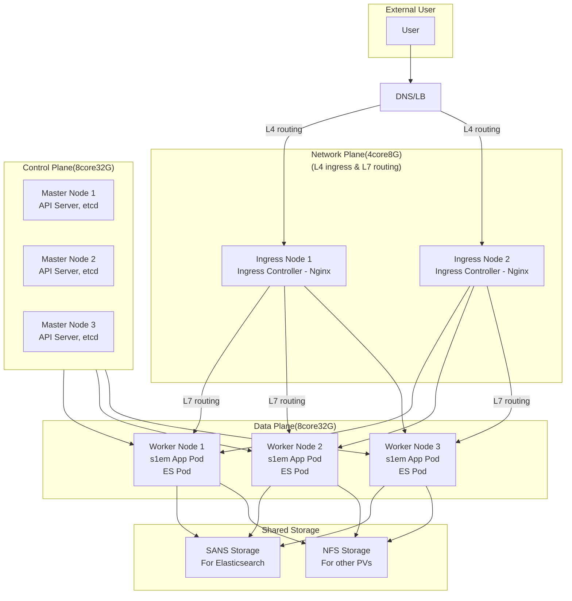

## K8s 클러스터 구축 제안서

### **1. 제안 개요**

본 문서는 `siem` 시스템을 안정적이고 확장 가능한 K8s 클러스터 환경으로 구축하기 위한 기술 아키텍처, 상세 사양, 그리고 구체적인 실행 계획을 제안합니다.

K8s 도입을 통해 **운영 효율성을 극대화**하고, 향후 **비즈니스 성장에 유연하게 대응**할 수 있는 기술 기반을 마련하는 것을 목표로 합니다.

### **2. K8s 도입 핵심 기대효과**

| 구분                                | 기대효과                                             | 설명                                                                                                                                                                                                  |
| :---------------------------------- | :--------------------------------------------------- | :---------------------------------------------------------------------------------------------------------------------------------------------------------------------------------------------------- |
| **유연한 확장성 (Scalability)**     | 트래픽 변화에 따른**신속하고 자동화된 스케일링**     | 사용자 요청량에 따라 서비스 노드(Pod)를 수평적으로 확장(Scale-out)하거나, 서버 자원을 증설(Scale-up)하여 중단 없는 서비스 제공이 가능합니다.                                                          |
| **운영 효율성 (Efficiency)**        | **인프라 관리 포인트 단일화 및 자동화**              | 컨테이너 이미지 기반의 배포는 개발, 테스트, 운영 환경의 일관성을 보장하며, IaC(Infrastructure as Code) 접근을 통해 인프라 관리를 자동화하고 휴먼 에러를 최소화합니다.                                 |
| **자원 최적화 (Optimization)**      | **물리적/가상 자원의 사용률 극대화**                 | 각 애플리케이션이 필요로 하는 만큼의 CPU와 메모리를 정밀하게 할당하고 격리하여, 유휴 자원을 최소화하고 서버 자원 운영 비용을 절감합니다.                                                              |
| **높은 가용성 (High Availability)** | **장애 발생 시 자동 복구를 통한 서비스 연속성 확보** | 특정 노드나 애플리케이션에 장애가 발생하면 K8s가 이를 감지하여 정상 노드로 워크로드를 자동 재배치합니다. 특히 ES 클러스터와 같은 Stateful 애플리케이션도 데이터 손실 없이 안정적으로 운영 가능합니다. |

---

### **3. 제안 아키텍처 (Proposed Architecture)**

`s1em` 시스템을 위한 K8s 클러스터는 고가용성과 성능을 고려하여 Control Plane, Data Plane, Storage 계층으로 명확히 분리하여 설계합니다.

* **Control Plane (HA 구성):** 클러스터의 '두뇌' 역할을 하는 마스터 노드를 3대 이상으로 구성하여, 일부 마스터 노드에 장애가 발생하더라도 API 서버와 etcd가 중단 없이 클러스터 전체를 안정적으로 관리합니다.
* **Data Plane:** 실제 `s1em` 애플리케이션과 Elasticsearch 등 워크로드가 실행되는 공간입니다. 초기 3대의 워커 노드로 시작하며, 서비스 부하에 따라 유연하게 확장할 수 있습니다.
* **Storage:** 데이터의 영속성을 보장하기 위한 외부 스토리지 계층입니다. I/O 성능이 중요한 Elasticsearch 데이터는 **SANS**를 통해, 기타 설정 파일이나 로그 데이터 등은 **NFS**를 통해 Persistent Volume으로 연동하는 하이브리드 전략을 제안합니다.
* **Network (Ingress):** 외부 트래픽이 K8s 클러스터 내부 서비스로 진입하는 관문입니다. **Ingress Controller**를 통해 URL 기반 라우팅, SSL/TLS 처리 등을 수행하며 외부 로드밸런서와 연동됩니다.

---

### **4. 상세 기술 사양**

최적의 성능과 안정성을 위해 아래와 같은 사양을 권장합니다. (OS: **Ubuntu 22.04 LTS** 기준)

| 구분                 | 역할                   | 권장 사양 (서버당)                     | 수량 | 비고                                        |
| :------------------- | :--------------------- | :------------------------------------- | :--: | :------------------------------------------ |
| **Control Plane**    | K8s Master Node (HA)   | 8 vCPU, 32GB RAM, 50GB+ SSD (for etcd) |  3  | 클러스터 관리의 안정성과 고가용성 확보      |
| **Data Plane**       | K8s Worker Node        | 8 vCPU, 32GB RAM                       |  3+  | 실제 서비스 워크로드 실행, 필요시 확장 가능 |
| **Storage**          | Elasticsearch 데이터용 | **SANS (Block Storage)**               |  -  | 빠른 I/O 속도 보장, ES 클러스터 성능 극대화 |
| **(Option) Network** | L4 Ingress/L7 Routing | 4 vCPU, 8GB RAM                        |  2  | 트래픽 관문 역할, 안정성을 위한 이중화(HA)  |

> **고려사항:** 개발 환경에서 64GB RAM을 사용 중인 점을 감안할 때, 초기 운영 환경의 워커 노드 RAM은 32GB로 시작하되, **Prometheus/Grafana** 기반의 면밀한 모니터링을 통해 **리소스 사용 추이를 분석하고 증설(Scale-up) 시점을 예측**하는 것이 중요합니다.

---

### **5. 프로젝트 수행 계획 (8주)**

체계적인 단계를 통해 리스크를 최소화하고 성공적인 K8s 클러스터 구축을 보장합니다.

| 주차 | 목표 | 상세 수행 과업 |
|:------------|:----------------------------------|:--------------------------------------|
| **1주차** | **인프라 준비 및 설계 확정** | • K8s 클러스터 구축을 위한 서버, 네트워크 자원 할당 및 설정 검토• 최종 아키텍처 및 상세 사양 확정 |
| **2주차** | **K8s 클러스터 기본 구축** | • **Control Plane** 설치 및 고가용성(HA) 구성 (kubeadm, etcd 클러스터 등)• **Data Plane** 워커 노드 설치 및 클러스터 조인 |
| **3주차** | **핵심 인프라 연동** | • **SANS/NFS 스토리지** 연동 및 PV(Persistent Volume)/PVC(Persistent Volume Claim) 테스트• **클러스터 모니터링/로깅** 시스템 구축 (Prometheus, Grafana, ELK Stack) |
| **4주차** | **네트워크 및 테스트 환경 구축** | • **Ingress Controller** 설치 및 외부 LB/DNS 연동• 샘플 애플리케이션(Nginx) 배포를 통한 전체 흐름(네트워크, 스토리지) 검증 |
| **5주차** | **마이그레이션 준비 #1 (single)** | • 기존 `docker-compose-single.yaml`을 K8s Manifest 변환• 개발팀 대상 K8s 기본 개념 및 Manifest 작성법 교육/지원 |
| **6주차** | **마이그레이션 준비 #2 (multi)** | • 기존 `docker-compose-multi.yaml`의 K8s Manifest 변환 및 배포 테스트• 서비스 간 의존성, 환경변수 설정 등 복잡한 배포 시나리오 지원 |
| **7-8주차** | **실 서비스 배포 및 안정화** | • **실제 `s1em` 서비스 배포** 및 운영 안정성 검증• **배포/운영 표준 절차서** 및 **장애 대응 매뉴얼** 문서화• 및 운영 교육 |
